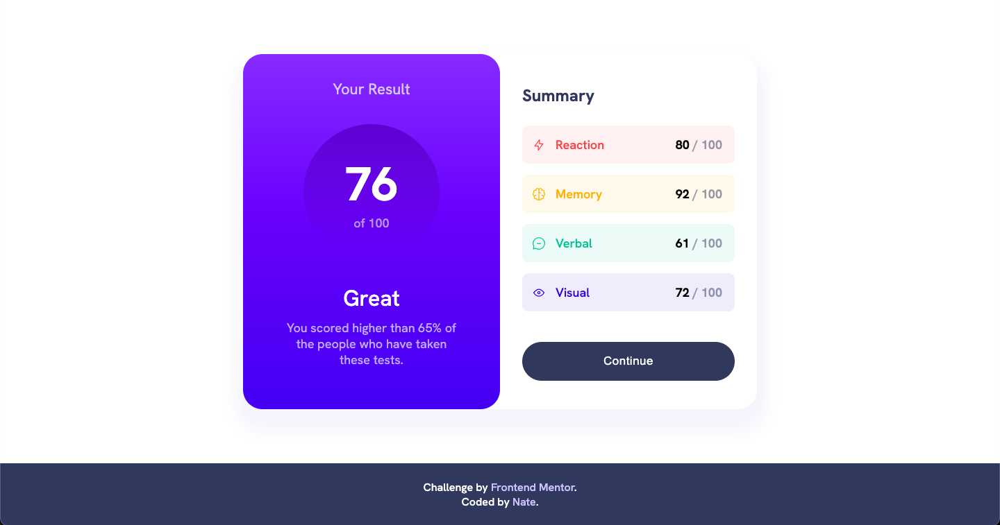

# Frontend Mentor - Results summary component solution

This is a solution to the [Results summary component challenge on Frontend Mentor](https://www.frontendmentor.io/challenges/results-summary-component-CE_K6s0maV). Frontend Mentor challenges help you improve your coding skills by building realistic projects. 

## Table of contents

- [Overview](#overview)
  - [The challenge](#the-challenge)
  - [Screenshot](#screenshot)
  - [Links](#links)
- [My process](#my-process)
  - [Built with](#built-with)
  - [What I learned](#what-i-learned)
  - [Continued development](#continued-development)
  - [Useful resources](#useful-resources)
- [Author](#author)

## Overview

### The challenge

Users should be able to:

- View the optimal layout for the interface depending on their device's screen size
- See hover and focus states for all interactive elements on the page
- **Bonus**: Use the local JSON data to dynamically populate the content

### Screenshot

### Links

- Solution URL: [Add solution URL here](https://your-solution-url.com)
- Live Site URL: [ntjnh-fem-results-summary.netlify.app](https://ntjnh-fem-results-summary.netlify.app/)

## My process

### Built with

- [React](https://reactjs.org/)
- [SCSS](https://sass-lang.com/)
- Mobile-first

### What I learned

This was a good chance for me to practice a little bit of React. Other than creating two separate components for the results and the summary, I got to have a go at using data from a JSON file to dynamically populate the result categories.

### Continued development

One thing I struggled to do was get the images to display by referencing their paths as they appear in the JSON file. When files from the assets folder are imported into any of the JSX files, Vite gives them hashed names in the build version. I don't think this works when a file path is referenced directly as a string. Vite's documentation has useful information and advice about this. I'll try that next time I need to import/reference local files.

### Useful resources

- [How to Set backgroundImage with Inline CSS Style](https://www.freecodecamp.org/news/react-background-image-tutorial-how-to-set-backgroundimage-with-inline-css-style/) - This came in handy when I was trying to figure out how to use `background-image` in a style tag. I forgot about the camelCase thing. 🙄
- [Static Asset Handling - Vite](https://vitejs.dev/guide/assets.html#static-asset-handling) - Vite's page that explains all about bundling and asset hashing

## Author

- Website - [Nate](https://natejonah.com)
- Frontend Mentor - [@ntjnh](https://www.frontendmentor.io/profile/ntjnh)
- Twitter - [@natejonah](https://www.twitter.com/natejonah)
